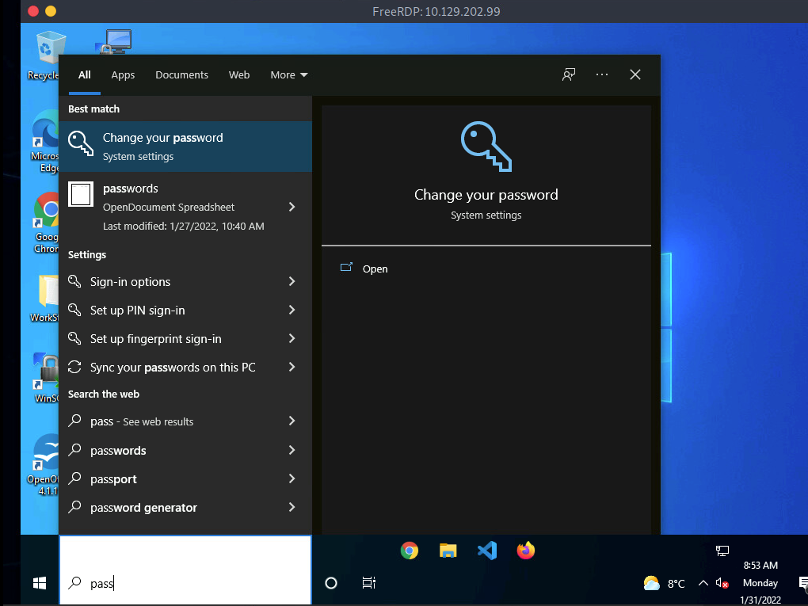

# Identifying SSRF

After discussing the basics of SSRF vulnerabilities, let us jump right into an example web application.

***

## Confirming SSRF

Looking at the web application, we are greeted with some generic text as well as functionality to schedule appointments:

<figure><figcaption></figcaption></figure>

After checking the availability of a date, we can observe the following request in Burp:

<figure><figcaption></figcaption></figure>

As we can see, the request contains our chosen date and a URL in the parameter `dateserver`. This indicates that the web server fetches the availability information from a separate system determined by the URL passed in this POST parameter.

To confirm an SSRF vulnerability, let us supply a URL pointing to our system to the web application:

<figure><figcaption></figcaption></figure>

In a `netcat` listener, we can receive a connection, thus confirming SSRF:

```shell-session
$ nc -lnvp 8000

listening on [any] 8000 ...
connect to [172.17.0.1] from (UNKNOWN) [172.17.0.2] 38782
GET /ssrf HTTP/1.1
Host: 172.17.0.1:8000
Accept: */*
```

To determine whether the HTTP response reflects the SSRF response to us, let us point the web application to itself by providing the URL `http://127.0.0.1/index.php`:

<figure><figcaption></figcaption></figure>

Since the response contains the web application's HTML code, the SSRF vulnerability is not blind, i.e., the response is displayed to us.
