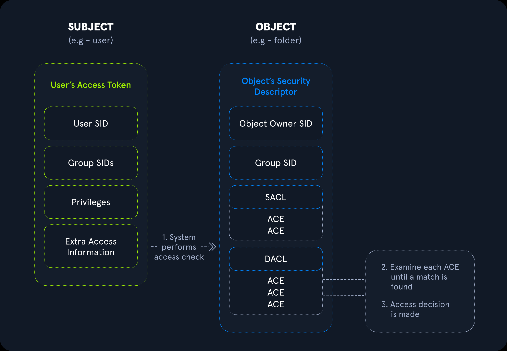

# 1.1 - Introduction to Linux

## 4 Major Characteristics of Linux

1. **Linux is a kernel.** Linux is a fully-networked 32/64-Bit Operating System, including core utilities
2. **Linux is open source**. The source code for the operating system as well as its core utilities are freely available
3. **Linux has distributions.** There are hundreds of Linux distributions available to choose from. There are distributions suited to every imaginable purpose
4. **Linux embraces the CLI**. Although some distributions have a typical desktop graphical user interface (GUI), the Linux community celebrates the command line interface (CLI) that relies primarily on keyboard input.

### Linux is a Kernel

• Linux means the kernel of the system, which is the central controller of everything that happens on the computer.&#x20;

• Linux is a combination of software called GNU/Linux, which defines the operating system.&#x20;

– GNU is the free software that provides open-source equivalents of many common UNIX commands. – The Linux part of this combination is the Linux kernel, which is the core of the operating system.

## Short story of Linux

• Linux started in **1991** as a hobby project by **Linus Torvalds**, a Finnish born computer scientist studying at the University of Helsinki.&#x20;

• The GNU Project was developed by **Richard Stallman in 1983**.&#x20;

• Linux programmers were able to incorporate the GNU tools to provide a complete operating system.

• The story of Linux begins with UNIX, an operating system developed at AT\&T Bell Labs in the 1970s, written in the C language.&#x20;

• Linux was developed by Linus Torvalds based on UNIX – Linus Torvalds created it from scratch with assistance from programmers around the world – It was first **posted on the internet in 1991**&#x20;

• **Linux 1.0** was released in **1994** and **Linux 2.2 in 1999**&#x20;

• Today Linux is used on more than **3 billion** devices&#x20;

• All the **top 500 supercomputers** are based on Linux (or Unix-like) system

## Linux and the GNU Project

• Linus Torvalds developed the Linux kernel – the core of the OS, inspired by the open source movement and the GNU project.&#x20;

• The GNU Project is a free software, mass collaboration project, announced on September 27, 1983, by Richard Stallman at MIT.&#x20;

– Goal: create a Unix compatible software system composed of entirely free software.&#x20;

– GNU General Public License (GNU GPL).

## Linux Architecture

• **Hardware:** CPU, memory units, block devices and network adapters&#x20;

• **Kernel:** The kernel is the heart of the operating system. It interacts with the hardware and is doing most of the tasks like memory management, task scheduling and file management&#x20;

• **Core Utilities:** preinstalled software for different purpose including shell programs&#x20;

• **Application Program:** web browser, web servers and more

<figure><figcaption>
Linux Architecture
</figcaption></figure>

## Linux is Open-Source

• Historically, most software has been issued under a closed-source license.&#x20;

• This means that you get the right to use the executable program or machine code, but cannot see the source code.&#x20;

• The development of Linux closely parallels the **rise of open-source** software.&#x20;

• The open-source philosophy is that you have a **right to obtain the software source code** and to **modify it for your own use**.

• When programmers on the Internet can read, modify and redistribute the source code of a software, **it evolves**.&#x20;

• People adapt it and improve it by fixing bugs.&#x20;

• This can happen at a speed that, compared to conventional software development, seems astonishing

• Torvalds has placed the code under a license called **GNU General Public License version 2 (GPLv2)**.&#x20;

– The source code **must be made available to anyone** who asks and **anyone is allowed to make changes**&#x20;

– Changes to the source code **must be placed under the same license**&#x20;

– No one is allowed to **charge for the source code other than the cost of distributing**

## The Free Software Foundation (FSF)

• Richard Stallman founded the Free Software Foundation (FSF) in 1985 with the goal of promoting free software.&#x20;

– Note: The word "free" does not refer to the price, but to the freedom to share, study, and modify the underlying source code.&#x20;

• The FSF maintains GNU General Public Licenses (GNU) to ensure that **all future variants** and modifications of the original program **must have exactly the same freedom of use** as the original. This philosophy is called **copyleft**.

## The Open Source Initiative (OSI)

• The Open Source Initiative is more permissive in how they allow software to be redistributed

– BSD (Berkeley Software Distribution) license state that you may redistribute the source, as long as you maintain copyright notices and don’t imply that the original creator endorses your version. “Do what you want with this software, just don’t say you wrote it”.&#x20;

– MIT License does not contain copyleft provisions.

## Creative Commons

An organization created to address the intentions behind open-source licenses for non- software entities

<figure><figcaption>
Creative Commons
</figcaption></figure>

## Operating Systems and Linux Distributions

